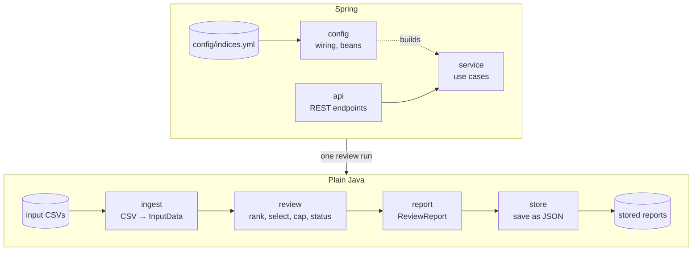

# Design

How the Index Reviewer is built. Why it is built this way, what was rejected, and the assumptions (A*n*) are in
[APPROACH.md](APPROACH.md).

## Goals

The brief asks for a correct SMI Q3 2026 review with data validation, traceability and design documentation,
easy to extend to new indices, review dates and rules. So the design aims to be:

- **Correct and explainable:** every number in the report traces back to a rule and the input it came from.
- **Configurable:** index parameters and review dates are business configuration, not code. Input and report
  storage sit behind small interfaces, so replacing one doesn't touch the review.
- **Testable:** the review logic is plain Java without Spring or I/O, so each rule is unit-tested on its own.
- **Simple:** one module, no database, reports stored as JSON files. More waits until a requirement needs it.

## Architecture



`ReviewService` looks up the index and review period, then chains the four steps. The controller only maps HTTP
to it, so a scheduler or CLI could run a review the same way. All packages share the types in `domain`, left
out of the diagram.

| Package | Responsibility |
|---|---|
| `domain` | Input model (`InputData`, `SecurityData`, `DataQualityWarning`) and index definitions (`IndexDefinition`, `ReviewPeriod`, `RankingStrategy`), which validate themselves when constructed. |
| `ingest` | `InputSource` provides a review's input; `CsvFolderInputSource` reads its three CSVs and records a warning per problem row. |
| `review` | The review pipeline (below). Its `ReviewResult` keeps every intermediate step. |
| `review.status` | `StatusAssessment` derives the review status from a finished `ReviewResult`. The review never depends on it. |
| `report` | Turns a `ReviewResult` into the `ReviewReport`, rounding for display only. |
| `store` | `ReportStore` keeps every report as written; `FileReportStore` writes one JSON file per run. |
| `service` | `ReviewService`: the use cases (list indices, check input, run and store a review, read stored reports). `IndexCatalog` looks up configured indices and periods; unknown ones give a 404. |
| `api` | `IndexController`, and RFC 9457 problem responses for every error, Spring MVC's own and a generic 500 included. |
| `config` | Spring wiring, outermost: binds `config/indices.yml` and `application.properties` and exposes the beans. Nothing depends on it. |

Spring appears only in `config`, `service` (for `@Service`) and `api`. `domain`, `review` and `report` use only
the JDK; `ingest` adds OpenCSV and `store` Jackson. Only `service` and `api` log: each stored run at INFO,
unexpected errors at ERROR. `ArchitectureTest` enforces these rules, the dependency direction in the diagram
and the absence of package cycles, so a violation fails the build.

## Review pipeline

`ReviewEngine.run(index, period, input)` runs four steps, each a small class:

| Step | Class | Rule |
|---|---|---|
| 1. Eligibility | `Eligibility` | In the universe on the review date, with a price on the cut-off date and shares and free float on the review date. Others are excluded with a reason (A2, A15). |
| 2. Ranking | `Ranking` | By the ranking value of the configured `RankingStrategy` (`FFMCAP`), highest first; ties broken by id (A8). |
| 3. Selection | `Selection` | Ranks 1–18 directly. From the buffer (ranks 19–22), current constituents first, then new candidates, in rank order, until there are 20 (rulebook 5.12.3.2, A7). |
| 4. Capping | `WeightCapping` | Constituents above 18% get exactly 18%; the rest share the remaining weight in proportion to FFMCAP. Repeats until none is above the cap (rulebook 5.12.4, A14). |

Joiners and leavers come from comparing the selection with the current composition. Each leaver has a reason:
not in the universe, not eligible, buffer full, or below the buffer.

**Iterative capping (A14).** Read literally, rulebook 5.12.4 caps only constituents whose *raw* share is above
18%, in one pass, which can leave a weight above the cap after redistribution. The loop caps those too. For Q3
both readings agree (one round); at a 15% cap the real data shows the difference (`63` would end at 15.60%).

**Weights and capping factors** are both reported. The final weight is the review's result, checkable against
the cap. The capping factor is what index calculation carries forward until the next review: proportional to
weight / FFMCAP, scaled so uncapped constituents have 1 (A11). The brief's "weighting factors" are read as
capping factors.

**Precision.** All arithmetic uses `BigDecimal` with 34 significant digits and no intermediate rounding.
`WeightCapping` checks on every run that the weights add up to 1 (within 1e-20) and none exceeds the cap. Only
the report rounds: weights to 6 decimals in percent, capping factors to 10. The displayed Q3 weights therefore
add up to 99.999999%; they are never adjusted to force 100%.

## Data validation and review status

Validation has two layers:

- **Per file, strict:** a missing folder, file or column, or a file that is not valid UTF-8, stops the review
  with a 422. So does a review where fewer securities can be ranked than the index has constituents (A12); no
  report is stored.
- **Per row, lenient:** an invalid row (wrong field count, unparsable or out-of-range value) or a duplicate is
  skipped with a `DataQualityWarning` naming the file, line and security (A1, A9, A10).

Each warning has an **impact**: `NONE` (nothing lost, e.g. an identical duplicate) or `MISSING_DATA` (a row
ignored, conflicting rows dropped, a security excluded).

The **review status** tells a reviewer whether to look closer. `StatusAssessment.assess(result)`, called by
`ReportBuilder`, derives it:

| Status | When |
|---|---|
| `COMPLETED` | No warnings. |
| `COMPLETED_WITH_WARNINGS` | Only warnings that can't change the result. |
| `REQUIRES_ATTENTION` | Missing data on a current constituent, on a security ranked within the buffer, on an unknown security, or on an unranked security whose estimated ranking value is at least half the value at the buffer end (A13). |

The estimate (`UnrankedEstimate`) fills gaps with the other date's values, hence the wide margin: 17 ids change
shares and 41 change free float between the two dates.

The status comes with one reason per warning and affected security, harmless ones included. A reason's
`relevance` decides the status; its `explanation` is for people. For Q3:

```json
{ "securityId": "166", "relevance": "ESTIMATED_FAR_BELOW_BUFFER",
  "explanation": "Not ranked, estimated FFMCAP 12890814 is below half the value at buffer end rank 22 (15376002109)",
  "warning": { "source": "review", "line": null, "impact": "MISSING_DATA", "message": "Excluded from ranking: ..." } }
```

## Traceability

A report answers "why is this security in or out, and with what weight?" without re-running anything. It holds:

- the index parameters, including the rulebook version and section they follow;
- the full ranking, with a selection decision for every security and the price, shares and free float behind
  its FFMCAP, so every value can be recomputed by hand;
- leavers with reasons (securities excluded from ranking appear as warnings with their reason);
- each constituent's raw weight, final weight and capping factor, and the capping rounds;
- the paths of the input files read, all data-quality warnings and the reasons for the status;
- the application version and Git revision that produced it (`-dirty` with uncommitted changes, `unknown`
  without Git).

Every run is stored once and never changed, so "which report did we publish for Q3, and when?" has an answer
even after the configuration or data change. The same input and build always give the same report, apart from
`generatedAt`: collections keep insertion order and ties are broken by id.

## Configuration and extensibility

- **Business parameters** live in `config/indices.yml`. A default copy is packaged in the jar; a file in the
  working directory overrides it. Invalid values stop the app at startup: a missing rulebook version, a buffer
  end below the constituent count, a cap outside (0, 1] or too small to reach 100%, an index name or period id
  that can't be a folder name, or an unknown ranking strategy.
- **Input** lives in one folder per index and review period, so past reviews can be re-run.
- **Technical settings** (data and report folders, API docs paths) stay in `application.properties`.

| Change | What to do |
|---|---|
| New quarter | Add a review period to the YAML and a `data/<index>/<period>/` folder. No code change. |
| New index with the SMI's kind of rules (one cap, a buffer), other numbers | Add an index block to the YAML and its data folder. No code change. |
| Tiered capping (e.g. SLI: largest 4 at 9%, rest at 4.5%, rulebook 5.17.4) | Let `WeightCapping` take a cap per constituent instead of one value (the loop stays), add the tier parameters to `IndexDefinition` and the YAML, and compute the caps in `ReviewEngine`. |
| New ranking criterion from price, shares and free float | Add a `RankingStrategy` constant and its `case` in `EligibleSecurity.rankingValue` (the compiler insists), then select it in the YAML. |
| The rulebook's selection list (A4: 12-month average FFMCAP and turnover) | Add turnover and history to the input files, `InputData` and the loader; compute the ranking value from the review's whole input, not one `EligibleSecurity`; decide what happens to securities with a short history. `Eligibility` stays: the weights still need FFMCAP. |
| New selection or weighting rule | Replace or add a step in `ReviewEngine`. |
| Reports in a database, or input from a market-data system | Implement `ReportStore` or `InputSource` and expose it as the bean in `ReviewConfiguration`. Nothing else changes. |

## API

| Method and path | Result |
|---|---|
| `GET /api/indices` | Configured indices and review periods |
| `GET /api/indices/{index}/reviews/{period}/input` | Loaded input without running the review: files read, counts per date, composition, warnings |
| `POST /api/indices/{index}/reviews/{period}` | Runs and stores the review. **201 Created** with a summary (status, constituents with weights, joiners, leavers) and `reportUrl`, the same URI as the `Location` header |
| `GET /api/indices/{index}/reviews/{period}/reports` | Stored runs, oldest first: id, generation time, status |
| `GET /api/indices/{index}/reviews/{period}/reports/{id}` | One stored report, byte for byte as written |

A review is a `POST` because it creates a stored report. Reports are written to
`<index-reviewer.reports-dir>/<index>/<period>/<run id>.json` (default `./reports`, git-ignored). The run id is
the UTC generation time to the nanosecond, e.g. `20260925T201052184253999Z`. Unknown indices, periods and ids
give 404; unusable input 422. `/actuator/health` and `/actuator/info` (version, Git branch and commit) are
exposed too. The contract is the springdoc OpenAPI spec at `/api-docs` (Swagger UI at `/swagger-ui.html`); the
Postman collection in `postman/` has example calls with test scripts.

## Testing

| Level | Tests |
|---|---|
| Rules | `WeightCappingTest` (the brief's example, multi-round capping, all constituents capped, a weight exactly at the cap, the invariant check), `SelectionTest` (incumbent priority, buffer overflow), `RankingTest` (tie-break, A8), `StatusAssessmentTest` (every status path and the estimate's boundaries) |
| Validation | `IndexDefinitionTest`, `IndexReviewerPropertiesTest` (every rule that stops startup), `SecurityDataTest` (duplicate vs. conflict, A9) |
| Ingest | `InputDataLoaderTest`: BOM or none, CRLF, invalid UTF-8, blank lines, duplicates, invalid and out-of-range rows with line numbers, conflicts, empty and missing files and columns |
| Real data | `ReviewEngineTest` and `ReportBuilderTest` check the Q3 result on the provided CSVs; `ReviewEngineTest` also runs a 15% cap (two capping rounds) and too few rankable securities (A12) |
| Storage | `FileReportStoreTest`: file naming, no overwrite, listing order, unknown and unsafe ids |
| Use cases | `ReviewServiceTest`: runs, stores and lists a Q3 review without Spring, as a non-HTTP caller would |
| API | `IndexControllerTest`: all endpoints on the real config and data, 404s and Spring's own 404/405 as problem responses, the OpenAPI schemas. `ApiExceptionHandlerTest`: 422 with the reason, 500 without internals |
| Architecture | `ArchitectureTest` (ArchUnit): dependency direction, plain-Java core, where Spring may appear, no cycles |
| Manual | Postman test scripts for the same expected results |

Beyond the tests:

- **Formatting:** Spotless with palantir-java-format, checked in the build.
- **Error Prone** runs on every compile; its warnings fail the build.
- **Mutation testing** (`./gradlew pitest`) plants small bugs in `review` and checks that a test catches each:
  169 of 172 are caught, and the 3 survivors are harmless (see APPROACH.md, *Code quality*).
- **Coverage** (`./gradlew test jacocoTestReport`): 99% of lines, 99.6% of branches; the rest are one-line
  exception rethrows and code that cannot fail.

## Limits of the design

**Rulebook simplifications**, where the brief simplifies the rulebook and the data doesn't allow more:

- Ranking uses point-in-time FFMCAP, not the rulebook's selection list with turnover (A4). What adding it takes
  is in the extensibility table.
- The liquidity rule for instruments listed on several exchanges isn't applied (A5): no listing or turnover data.
- Each id is its own issuer, so issuer-level capping isn't applied (A6).

**Deliberately not built.** Each adds features rather than design, and the brief values simplicity over feature
count:

- **Indices that depend on other indices.** The SMIM's universe is "SMI Expanded minus the SMI" (rulebook
  5.16.4), so its review needs another index's result. Here each index has its own universe file.
- **The SLI in full.** Tiered capping is a small change (see the table), but its 9% tier comes from a half-year
  ranking with no data here.
- **Review schedule rules.** The SMI's ordinary review is annual, on the third Friday of September (5.12.3.1).
  Review periods are a configured list of dates, not generated from a rule; there are no extraordinary reviews.
- **Chained reviews.** The current composition comes from `composition.csv`, not from the last stored run, and
  no run is marked as the official one.
- **Versioned configuration and archived input.** Re-running a period after changing `indices.yml` adds a new
  report under the same period id; the report records the parameters and rulebook version it used. It keeps the
  input values the result came from, but not the files, and nothing identifies their version.
- **A database.** Reports are files; `ReportStore` is the seam for one.
