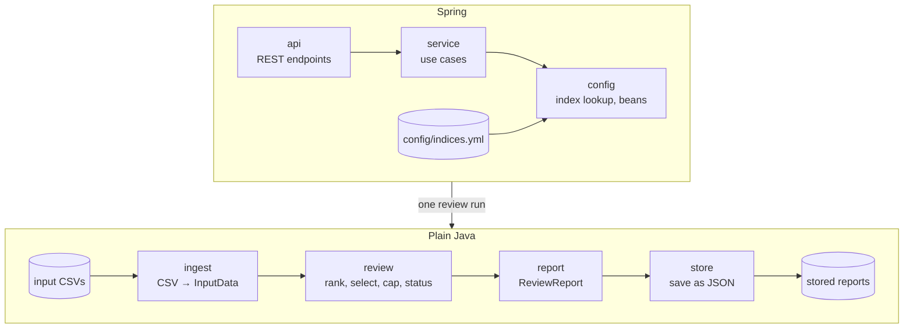

# Design

How the Index Reviewer is built. The reasoning behind each choice, and the options that were rejected, are in
the decision log [APPROACH.md](APPROACH.md) (referenced below as D*n* for decisions and A*n* for assumptions).

## Goals

The brief asks for a correct SMI Q3 2026 review with data validation, traceability and design documentation.
It must be easy to extend to new indices, review dates and rules. The design follows from that:

- **Correct and explainable:** every number and every decision in the report can be traced to a rule and to
  the input it came from.
- **Configurable, not hard-coded:** index parameters and review dates are business configuration.
- **Testable:** the review logic is plain Java without Spring or I/O, so each rule is unit-tested in isolation.
- **Simple:** no database, one module (D2, D5). Reports are stored as plain JSON files (D21). Anything more
  waits until a requirement needs it.

## Architecture



`ReviewService` looks up the index and review period, then chains the four steps; the controller only maps
HTTP to it (D24), so a scheduler or CLI could run a review the same way. All of them share the types
in `domain` (input model and index definitions), which is left out of the diagram.

| Package | Responsibility |
|---|---|
| `domain` | Input model (`InputData`, `SecurityData`, `DataQualityWarning`, `InputFile`) and index definitions (`IndexDefinition`, `ReviewPeriod`). The definitions validate themselves when constructed. |
| `ingest` | `InputSource` provides a review's `InputData` (D28); `CsvFolderInputSource` reads the three CSVs of one review, recording a warning for each problem row. |
| `review` | The review pipeline (below). Produces a `ReviewResult` that keeps every intermediate step; its review status is derived from it (`StatusAssessment`, D27). |
| `report` | Renders a `ReviewResult` as the `ReviewReport`, rounding for display only. |
| `store` | `ReportStore` keeps every report as written; `FileReportStore` writes one JSON file per run (D21). |
| `config` | Binds `config/indices.yml`, looks up indices and periods, and exposes the input source, engine, report builder and report store as beans. |
| `service` | `ReviewService`: the use cases (list indices, check input, run and store a review, read stored reports). Chains load → review → report → store (D24). |
| `api` | `IndexController` and RFC 9457 error mapping. The controller only maps HTTP to `ReviewService`. |

Only `config`, `service` and `api` depend on Spring (D4, D14, D24); `service` only for its `@Service` annotation. `store` uses Jackson for the JSON format, nothing else.

## Review pipeline

`ReviewEngine.run(index, period, input)` runs four small, independent steps (D15):

| Step | Class | Rule |
|---|---|---|
| 1. Eligibility | `Eligibility` | In the universe on the review date, with a price on the cut-off date and shares and free float on the review date. Others are excluded with a reason (A2). |
| 2. Ranking | `Ranking` + `RankingStrategy` | Ranking value from the strategy configured by name (`FFMCAP`), highest first. Ties are broken by id (A8). |
| 3. Selection | `Selection` | Ranks 1–18 are selected directly. From the buffer (ranks 19–22), current constituents are taken first, then new candidates, in rank order, until there are 20 (rulebook 5.12.3.2, A7). |
| 4. Capping | `WeightCapping` + `CappingRule` | The rule sets each constituent's cap: `SingleCap`, 18% for all SMI constituents. Constituents above their cap get exactly the cap. The rest share the remaining weight in proportion to FFMCAP. This repeats until none is above its cap (rulebook 5.12.4 and the brief's example). |

**Iterative capping (D20, A14):** a literal reading of rulebook 5.12.4 caps only constituents whose *raw* share
is above 18%, in a single pass. That can leave a weight above the cap after redistribution. The loop caps such
a constituent too, so no published weight exceeds the cap. For Q3 both readings give the same result (one
round); at a 15% cap the real data shows the difference (`63` would end at 15.60% in a single pass).

Joiners and leavers come from comparing the selection with the current composition. Each leaver has a reason:
not in the universe, not eligible, buffer full, or below the buffer.

**Weights and capping factors** are both reported, since they answer different questions (D20). The final
**weight** is the review's result, checkable against the cap and the brief's example. The **capping factor** is
what index calculation carries forward until the next review. It is derived from the final weights:
factor ∝ weight / FFMCAP, scaled so uncapped constituents have factor 1 (A11). FFMCAP × factor, normalised,
gives back the final weights. The brief's "weighting factors" is read as the capping factors.

**Precision (D13):** all arithmetic uses `BigDecimal` with 34 significant digits and no intermediate rounding.
`WeightCapping` checks two invariants on every run: weights add up to 1 within 1e-20, and none exceeds the
cap. Only the report rounds: weights to 6 decimals in percent, capping factors to 10. So the displayed Q3
weights add up to 99.999999%, which is expected; the displayed values are never adjusted to force 100%.

## Data validation and review status

Validation happens in two layers (D9):

- **Per file, strict:** a missing file, folder or column stops the review with a 422 response. Nothing
  meaningful can be computed without it.
- **Per row, lenient:** an invalid row (wrong field count, unparsable or out-of-range value) or a duplicate is
  skipped with a `DataQualityWarning` naming the file, line and security. One bad row doesn't block a quarterly
  review, but it stays visible.

Each warning has an **impact**: `NONE` (nothing lost, e.g. an identical duplicate row was dropped) or
`MISSING_DATA` (a row was ignored, conflicting rows were dropped, or a security was excluded).

The **review status** tells a reviewer whether to look closer (D10, D16). `StatusAssessment` in `review` derives
it from the result, available as `ReviewResult.assessment()` (D27):

| Status | When |
|---|---|
| `COMPLETED` | No warnings. |
| `COMPLETED_WITH_WARNINGS` | Only warnings that can't change the result. |
| `REQUIRES_ATTENTION` | Missing data on a current constituent, on a security ranked within the buffer end, on an unranked security whose estimated ranking value is not below half the value at the buffer end rank (A13), or on an unknown security; or fewer constituents than needed (A12). |

The estimate fills the gaps from the other date, so it gets a safety margin: 17 ids change shares and 41 change
free float between the two dates.

Every status comes with structured reasons (D22): one per warning and affected security, plus one if the index
is incomplete. Each has a `relevance` value that decides the status, and a sentence for people. All reasons are
kept, harmless ones too. For Q3:

```json
{ "securityId": "166", "relevance": "ESTIMATED_FAR_BELOW_BUFFER",
  "explanation": "Not ranked, estimated FFMCAP 12890814 is below half the value at buffer end rank 22 (15376002109)",
  "warning": { "source": "review", "line": null, "impact": "MISSING_DATA", "message": "Excluded from ranking: ..." } }
```

## Traceability

A report answers "why is this security in or out, and with what weight?" without re-running anything:

- the index parameters the review ran with;
- the full ranking, with a selection decision for every security;
- exclusions and leavers with reasons;
- each constituent's raw weight, final weight and capping factor, and the capping rounds;
- the input files with SHA-256 checksums, which prove which data produced the report (D12);
- all data-quality warnings, and the reasons behind the status.

Every run is stored as written (D21), so "which report did we publish for Q3, and when?" has an answer even
after the configuration or data changes. Stored files are created once and never changed.

The same input always gives the same report, apart from `generatedAt`. Collections keep insertion order, and
ties are broken by id.

## Configuration and extensibility

- **Business parameters** live in `config/indices.yml` (D11). A default copy is packaged in the jar, and a file
  in the working directory overrides it. Inconsistent values stop the app at startup. The records it binds to
  reject a buffer end below the constituent count, a cap outside (0, 1], or a cap too small for the weights to
  reach 100%. `IndexCatalog` rejects an unknown ranking strategy.
- **Input** lives in one folder per index and review period, so past reviews can be re-run (D12).
- **Technical settings** (data folder, display precision) stay in `application.properties`.

| Change | What to do |
|---|---|
| New quarter | Add a review period to the YAML and a `data/<index>/<period>/` folder. No code change. |
| New index with a single cap and a buffer (the SMI's rules, other numbers) | Add an index block to the YAML and its data folder. No code change. |
| Tiered capping (e.g. SLI: largest 4 at 9%, rest at 4.5%, rulebook 5.17.4) | Implement `CappingRule`, add its parameters to `IndexDefinition` and the YAML, and pick it in `ReviewEngine.cappingRule`. The capping loop is unchanged; `WeightCappingTest` runs a tiered rule already (D25). |
| New ranking criterion computed from price, shares and free float | Implement `RankingStrategy`, register it in `RankingStrategies`, and select it in the YAML. |
| The rulebook's selection list (A4: 12-month average FFMCAP and turnover) | Three steps (D26): add turnover and history to the input files, `InputData` and the loader; give `RankingStrategy` the review's input, not just one `EligibleSecurity`; decide what happens to securities without enough history. `Eligibility` stays: it checks the data the weights need. |
| New selection or weighting rule | Replace or add a step in `ReviewEngine`. Each step is a separate, tested class. |
| Store reports in a database | Implement `ReportStore` and expose it as the bean in `ReviewConfiguration`. Nothing else changes (D21). |
| Read input from a market-data system or database | Implement `InputSource` and expose it as the bean in `ReviewConfiguration`. Nothing else changes (D28). |

## API

| Method and path | Result |
|---|---|
| `GET /api/indices` | Configured indices and review periods |
| `GET /api/indices/{index}/reviews/{period}/input` | Loaded input: files with checksums, counts per date, composition, warnings |
| `POST /api/indices/{index}/reviews/{period}` | Runs the review, stores the report: **201 Created**, `ReviewReport` body, `Location` of the stored report |
| `GET /api/indices/{index}/reviews/{period}/reports` | Stored runs of the review, oldest first: id, generation time, status |
| `GET /api/indices/{index}/reviews/{period}/reports/{id}` | One stored report, byte for byte as written |

A review is a `POST`: it runs an action and creates a stored report (D17, D21). The store lives under
`index-reviewer.reports-dir` (default `./reports/<index>/<period>/<run id>.json`, git-ignored). The run id is
the UTC generation time, e.g. `20260925T201052184Z`. Unknown ids return 404. The contract is the springdoc OpenAPI spec
at `/api-docs`. The Postman collection in `postman/` holds example calls with test scripts (D6).

## Testing

| Level | Tests |
|---|---|
| Rules | `WeightCappingTest` (the brief's A/B/C example, a two-round cascade, all constituents capped, capping factors, a test-only tiered rule), `SelectionTest` (incumbent priority, buffer overflow, too few candidates), `IndexDefinitionTest`, `StatusAssessmentTest` (every status path, the estimate's safety margin) |
| Ingest | `InputDataLoaderTest`: BOM and CRLF, duplicates, invalid rows with line numbers, conflicts, checksums, missing files and columns |
| Real data | `ReviewEngineTest` and `ReportBuilderTest` check the Q3 result on the provided CSVs. `ReviewEngineTest` also runs the real data at a 15% cap, where capping needs a second round (D20) |
| Storage | `FileReportStoreTest`: file naming, no overwrite for runs in the same millisecond, chronological listing, unknown and unsafe ids |
| Use cases | `ReviewServiceTest`: runs, stores and lists a Q3 review without Spring, as a non-HTTP caller would; unknown index or period stores nothing |
| API | `IndexControllerTest`: all endpoints on the real config and data, including 201 with `Location`, stored reports returned as written, and 404s |
| Manual | Postman test scripts for the same expected results |

Decimal assertions use tolerances where the last of 34 digits can round either way.

## Known simplifications

Where the brief simplifies the rulebook, this is recorded and the design leaves room for the full rule:

- Ranking uses point-in-time FFMCAP, not the rulebook's selection list with turnover (A4). The data for it
  isn't provided; what adding it would take is in the extensibility table above (D26).
- The liquidity rule for instruments listed on several exchanges isn't applied (A5): the data has no listing
  or turnover fields.
- Each id is its own issuer, so issuer-level capping isn't applied (A6).
- Reports are stored as files, not in a database (D2, D21). `ReportStore` is the seam for one.

The assumptions made where the brief and rulebook leave room are listed in
[APPROACH.md](APPROACH.md#deliberate-assumptions).
