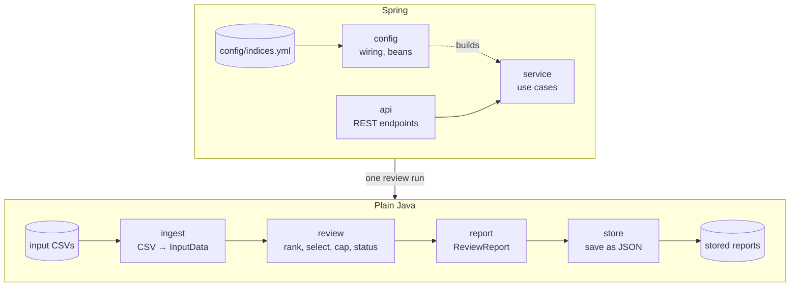

# Design

How the Index Reviewer is built. The reasoning behind each choice, and the options that were rejected, are in
[APPROACH.md](APPROACH.md), together with the assumptions (referenced below as A*n*).

## Goals

The brief asks for a correct SMI Q3 2026 review with data validation, traceability and design documentation.
It must be easy to extend to new indices, review dates and rules. The design follows from that:

- **Correct and explainable:** every number and every decision in the report can be traced to a rule and to
  the input it came from.
- **Configurable, not hard-coded:** index parameters, including the weight cap and the ranking strategy, and
  review dates are business configuration. The edges of the system (input, report storage) sit behind small
  interfaces, so replacing one doesn't touch the review.
- **Testable:** the review logic is plain Java without Spring or I/O, so each rule is unit-tested in isolation.
- **Simple:** no database, one module. Reports are stored as plain JSON files. Anything more
  waits until a requirement needs it.

## Architecture



`ReviewService` looks up the index and review period, then chains the four steps; the controller only maps
HTTP to it, so a scheduler or CLI could run a review the same way. All of them share the types
in `domain` (input model and index definitions), which is left out of the diagram.

| Package | Responsibility |
|---|---|
| `domain` | Input model (`InputData`, `SecurityData`, `DataQualityWarning`) and index definitions (`IndexDefinition`, `ReviewPeriod`, `RankingStrategy`). The definitions validate themselves when constructed. |
| `ingest` | `InputSource` provides a review's `InputData`; `CsvFolderInputSource` reads the three CSVs of one review, recording a warning for each problem row. |
| `review` | The review pipeline (below). Produces a `ReviewResult` that keeps every intermediate step. |
| `review.status` | The review status, derived from a finished `ReviewResult` (`StatusAssessment`). The review never depends on it. |
| `report` | Renders a `ReviewResult` as the `ReviewReport`, rounding for display only. |
| `store` | `ReportStore` keeps every report as written; `FileReportStore` writes one JSON file per run. |
| `config` | Spring wiring, outermost: binds `config/indices.yml` and `application.properties`, and exposes the catalog, input source, engine, report builder and report store as beans. Nothing depends on it. |
| `service` | `ReviewService`: the use cases (list indices, check input, run and store a review, read stored reports). Chains load → review → report → store. `IndexCatalog` looks up configured indices and review periods; unknown ones raise `NotConfiguredException` (404). |
| `api` | `IndexController` and RFC 9457 error mapping for every error, including Spring MVC's own and a generic 500. The controller only maps HTTP to `ReviewService`. |

Only `config`, `service` and `api` depend on Spring; `service` only for its `@Service` annotation.
`domain`, `review` and `report` use only the JDK; `ingest` uses OpenCSV and `store` Jackson, nothing
else. Logging (SLF4J) sits in `service` and `api`: every stored run is logged at INFO, unexpected errors at ERROR.
`ArchitectureTest` enforces this, the direction of the dependencies in the diagram, and that packages have no
cycles, so a violation fails the build.

## Review pipeline

`ReviewEngine.run(index, period, input)` runs four small, independent steps:

| Step | Class | Rule |
|---|---|---|
| 1. Eligibility | `Eligibility` | In the universe on the review date, with a price on the cut-off date and shares and free float on the review date. Others are excluded with a reason (A2). |
| 2. Ranking | `Ranking` + `RankingStrategy` | Ranking value under the strategy configured by name (`FFMCAP`, an enum), highest first. Ties are broken by id (A8). |
| 3. Selection | `Selection` | Ranks 1–18 are selected directly. From the buffer (ranks 19–22), current constituents are taken first, then new candidates, in rank order, until there are 20 (rulebook 5.12.3.2, A7). |
| 4. Capping | `WeightCapping` | One cap for all constituents, 18% for the SMI. Constituents above the cap get exactly the cap. The rest share the remaining weight in proportion to FFMCAP. This repeats until none is above its cap (rulebook 5.12.4 and the brief's example). |

**Iterative capping (A14):** a literal reading of rulebook 5.12.4 caps only constituents whose *raw* share
is above 18%, in a single pass. That can leave a weight above the cap after redistribution. The loop caps such
a constituent too, so no published weight exceeds the cap. For Q3 both readings give the same result (one
round); at a 15% cap the real data shows the difference (`63` would end at 15.60% in a single pass).

Joiners and leavers come from comparing the selection with the current composition. Each leaver has a reason:
not in the universe, not eligible, buffer full, or below the buffer.

**Weights and capping factors** are both reported, since they answer different questions. The final
**weight** is the review's result, checkable against the cap and the brief's example. The **capping factor** is
what index calculation carries forward until the next review. It is derived from the final weights:
factor ∝ weight / FFMCAP, scaled so uncapped constituents have factor 1 (A11). FFMCAP × factor, normalised,
gives back the final weights. The brief's "weighting factors" is read as the capping factors.

**Precision:** all arithmetic uses `BigDecimal` with 34 significant digits and no intermediate rounding.
`WeightCapping` checks two invariants on every run: weights add up to 1 within 1e-20, and none exceeds the
cap. Only the report rounds: weights to 6 decimals in percent, capping factors to 10. So the displayed Q3
weights add up to 99.999999%, which is expected; the displayed values are never adjusted to force 100%.

## Data validation and review status

Validation happens in two layers:

- **Per file, strict:** a missing file, folder or column, or a file that is not valid UTF-8, stops the review
  with a 422 response. Nothing meaningful can be computed without it. The same goes for a review where fewer
  securities can be ranked than the index has constituents (A12): it stops with a 422 and stores no report.
- **Per row, lenient:** an invalid row (wrong field count, unparsable or out-of-range value) or a duplicate is
  skipped with a `DataQualityWarning` naming the file, line and security. One bad row doesn't block a quarterly
  review, but it stays visible.

Each warning has an **impact**: `NONE` (nothing lost, e.g. an identical duplicate row was dropped) or
`MISSING_DATA` (a row was ignored, conflicting rows were dropped, or a security was excluded).

The **review status** tells a reviewer whether to look closer. `StatusAssessment` in `review.status` derives
it from the result (`StatusAssessment.assess(result)`, called by `ReportBuilder`):

| Status | When |
|---|---|
| `COMPLETED` | No warnings. |
| `COMPLETED_WITH_WARNINGS` | Only warnings that can't change the result. |
| `REQUIRES_ATTENTION` | Missing data on a current constituent, on a security ranked within the buffer end, on an unranked security whose estimated ranking value is not below half the value at the buffer end rank (A13), or on an unknown security. |

The estimate (`UnrankedEstimate`) fills the gaps from the other date, so it gets a safety margin: 17 ids change shares and 41 change
free float between the two dates.

Every status comes with structured reasons: one per warning and affected security. Each has a `relevance`
value that decides the status, and a sentence for people. All reasons are kept, harmless ones too. For Q3:

```json
{ "securityId": "166", "relevance": "ESTIMATED_FAR_BELOW_BUFFER",
  "explanation": "Not ranked, estimated FFMCAP 12890814 is below half the value at buffer end rank 22 (15376002109)",
  "warning": { "source": "review", "line": null, "impact": "MISSING_DATA", "message": "Excluded from ranking: ..." } }
```

## Traceability

A report answers "why is this security in or out, and with what weight?" without re-running anything:

- the index parameters the review ran with, including the rulebook version and section they follow;
- the full ranking, with a selection decision for every security and the price, shares and free float its
  FFMCAP was calculated from, so every value can be recomputed by hand;
- leavers with reasons; securities excluded from ranking appear as warnings with their reason;
- each constituent's raw weight, final weight and capping factor, and the capping rounds;
- the paths of the input files read;
- all data-quality warnings, and the reasons behind the status;
- the application version and Git revision that produced it (`build`; `-dirty` if built with uncommitted
  changes, `unknown` without a Git checkout).

Every run is stored as written, so "which report did we publish for Q3, and when?" has an answer even
after the configuration or data changes. Stored files are created once and never changed.

The same input and build always give the same report, apart from `generatedAt`. Collections keep insertion order, and
ties are broken by id.

## Configuration and extensibility

- **Business parameters** live in `config/indices.yml`. A default copy is packaged in the jar, and a file
  in the working directory overrides it. Inconsistent values stop the app at startup. The records it binds to
  reject a missing rulebook version, a buffer end below the constituent count, a cap outside (0, 1], a cap
  too small for the weights to reach 100%, or an index name or period id that can't be a folder name. An unknown ranking strategy fails when the YAML is bound to the enum.
- **Input** lives in one folder per index and review period, so past reviews can be re-run.
- **Technical settings** (data and report folders) stay in `application.properties`.

| Change | What to do |
|---|---|
| New quarter | Add a review period to the YAML and a `data/<index>/<period>/` folder. No code change. |
| New index with a single cap and a buffer (the SMI's rules, other numbers) | Add an index block to the YAML and its data folder. No code change. |
| Tiered capping (e.g. SLI: largest 4 at 9%, rest at 4.5%, rulebook 5.17.4) | Let `WeightCapping` take a cap per constituent instead of one value (the loop stays the same), add the tier parameters to `IndexDefinition` and the YAML, and compute the caps in `ReviewEngine`. |
| New ranking criterion computed from price, shares and free float | Add a constant to the `RankingStrategy` enum and its `case` in `EligibleSecurity.rankingValue` (the compiler insists), then select it in the YAML. |
| The rulebook's selection list (A4: 12-month average FFMCAP and turnover) | Three steps: add turnover and history to the input files, `InputData` and the loader; compute the ranking value from the review's input, not just one `EligibleSecurity`; decide what happens to securities without enough history. `Eligibility` stays: it checks the data the weights need. |
| New selection or weighting rule | Replace or add a step in `ReviewEngine`. Each step is a separate, tested class. |
| Store reports in a database | Implement `ReportStore` and expose it as the bean in `ReviewConfiguration`. Nothing else changes. |
| Read input from a market-data system or database | Implement `InputSource` and expose it as the bean in `ReviewConfiguration`. Nothing else changes. |

## API

| Method and path | Result |
|---|---|
| `GET /api/indices` | Configured indices and review periods |
| `GET /api/indices/{index}/reviews/{period}/input` | Loaded input: files read, counts per date, composition, warnings |
| `POST /api/indices/{index}/reviews/{period}` | Runs the review, stores the full `ReviewReport`: **201 Created**, summary body (status, constituents with weights, joiners, leavers) with `reportUrl`, the same URI as the `Location` header of the stored report |
| `GET /api/indices/{index}/reviews/{period}/reports` | Stored runs of the review, oldest first: id, generation time, status |
| `GET /api/indices/{index}/reviews/{period}/reports/{id}` | One stored report, byte for byte as written |

`GET /actuator/health` and `GET /actuator/info` (application version, Git branch and commit) are exposed as
well.

A review is a `POST`: it runs an action and creates a stored report. The store lives under
`index-reviewer.reports-dir` (default `./reports/<index>/<period>/<run id>.json`, git-ignored). The run id is
the UTC generation time to the nanosecond, e.g. `20260925T201052184253999Z`. Unknown ids return 404. The contract is the springdoc OpenAPI spec
at `/api-docs`. The Postman collection in `postman/` holds example calls with test scripts.

## Testing

| Level | Tests |
|---|---|
| Rules | `WeightCappingTest` (the brief's A/B/C example, a two-round cascade, all constituents capped, capping factors, a weight exactly at the cap, the invariant check), `SelectionTest` (incumbent priority, buffer overflow, incumbents outnumbering slots), `RankingTest` (tie-break by id, A8), `StatusAssessmentTest` (every status path, the estimate's safety margin and its exact boundaries) |
| Validation | `IndexDefinitionTest`, `IndexReviewerPropertiesTest`: every configuration rule that stops startup; `SecurityDataTest`: the duplicate/conflict comparison (A9) |
| Ingest | `InputDataLoaderTest`: with and without BOM, CRLF, invalid UTF-8, blank lines, duplicates, invalid and out-of-range rows with line numbers, conflicts, files read, empty files, missing files and columns |
| Real data | `ReviewEngineTest` and `ReportBuilderTest` check the Q3 result on the provided CSVs. `ReviewEngineTest` also runs the real data at a 15% cap, where capping needs a second round, and fails a review with too few rankable securities (A12) |
| Storage | `FileReportStoreTest`: file naming, no overwrite of an existing report, chronological listing, unknown and unsafe ids |
| Use cases | `ReviewServiceTest`: runs, stores and lists a Q3 review without Spring, as a non-HTTP caller would; unknown index or period stores nothing |
| API | `IndexControllerTest`: all endpoints on the real config and data, including 201 with a summary and `Location`, full stored reports returned as written, 404s, problem responses for Spring's own 404/405, the stored report's OpenAPI schema, and separate schemas for the summary's and the report's constituents. `ApiExceptionHandlerTest`: unusable input gives a 422 with the reason, unexpected errors a 500 without internals |
| Architecture | `ArchitectureTest` (ArchUnit): dependency direction between packages with `config` outermost, plain-Java review logic, Spring only in `config`, `service` and `api`, no package cycles |
| Manual | Postman test scripts for the same expected results |

Three checks look at the tests and the code themselves, next to formatting (Spotless with palantir-java-format,
checked in the build):

- **Error Prone** runs on every compile; its warnings fail the build.
- **Mutation testing** (`./gradlew pitest`) plants small bugs in `review` and checks that a test catches each:
  169 of 172 are caught; the 3 left are documented as harmless.
- **Coverage** (`./gradlew test jacocoTestReport`): 98% of lines, 99.6% of branches; what is left uncovered is
  one-line exception rethrows and code that cannot fail.

Decimal assertions use tolerances where the last of 34 digits can round either way.

## Known simplifications

Where the brief simplifies the rulebook, this is recorded and the design leaves room for the full rule:

- Ranking uses point-in-time FFMCAP, not the rulebook's selection list with turnover (A4). The data for it
  isn't provided; what adding it would take is in the extensibility table above.
- The liquidity rule for instruments listed on several exchanges isn't applied (A5): the data has no listing
  or turnover fields.
- Each id is its own issuer, so issuer-level capping isn't applied (A6).
- Reports are stored as files, not in a database. `ReportStore` is the seam for one.

The assumptions made where the brief and rulebook leave room are listed in
[APPROACH.md](APPROACH.md#deliberate-assumptions).

## Limits of the design

Extensions that are known but deliberately not built. Each adds features rather than design, and the brief rates
simplicity over feature quantity:

- **Indices that depend on other indices.** The SMIM's universe is "SMI Expanded minus the SMI" (rulebook 5.16.4),
  so its review needs another index's result. Here each index has its own universe file.
- **The SLI in full.** Tiered capping is a small change (see the table above), but its four 9% constituents
  come from a half-year ranking, for which there is no data.
- **Review schedule rules.** The SMI's ordinary review is annual, on the third Friday of September (5.12.3.1).
  Review periods are a configured list of dates, not generated from a rule, and there are no extraordinary
  reviews.
- **Chained reviews.** The current composition comes from `composition.csv`, not from the last stored run, and
  no run is marked as the official one.
- **Versioned configuration and archived input.** Re-running a period after changing `indices.yml` gives a new
  report under the same period id; the stored report records the parameters and rulebook version it used.
  The report keeps the input values the result was computed from, but the files themselves aren't archived
  with it, and nothing identifies their version.
